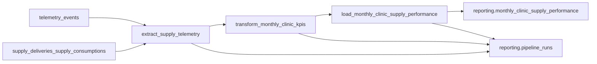

# PIPELINE_DESIGN — Desempeño mensual de insumos por clínica

Pipeline de desempeño de negocio para HealthCore (solo diseño — Parte 1).  
El código de orquestación, la aplicación del DDL y la implementación de `services/reporting/` corresponden a las Partes 2–3.

_Esta documentación está [disponible en inglés](./PIPELINE_DESIGN.md)._

**Fuente de verdad:** [`docs/data-pipelines/CONTEXT-healthcore-phase-1.md`](../../docs/data-pipelines/CONTEXT-healthcore-phase-1.md)  
**Piso de telemetría:** [`docs/telemetry/CONTEXT-healthcore.md`](../../docs/telemetry/CONTEXT-healthcore.md)

**Fuera de alcance de este pipeline (no modificar):**

- `services/app/domain/telemetry_analysis.py`
- `GET /telemetry/report`
- Escribir cualquier resultado en `telemetry_events` (fuente de solo lectura)

**Extensión de telemetría permitida:** campo aditivo `unit_cost` en el evento obligatorio existente `inbound_order_created` (solo costo de insumos — nunca PHI).

---

## 1. Estado actual

### 1.1 Lo que ya existe

| Capa | Artefacto | Rol hoy |
| --- | --- | --- |
| Captura | `uis/backoffice/lib/services/telemetry.ts` (`track()`) | Cola en memoria, flush por lotes, `sendBeacon`, reintento con backoff exponencial |
| Instrumentación | Formularios de inventario + UI relacionada | Eventos obligatorios: `inbound_order_created`, `outbound_order_created`, `stock_threshold_triggered`, `supply_expiry_flagged`, más eventos técnicos/de auth |
| Ingesta | `POST /telemetry/events` → `services/app/domain/telemetry_service.py` | Validación Pydantic por evento, filtro allowlist hacia `tags`, inserción masiva |
| Almacenamiento | Tabla Supabase `telemetry_events` | Filas de hechos append-only: `event_id`, `timestamp`, `event_type`, `service`, `user_id`, `session_id`, `tags` (JSONB) |
| Reporte técnico | `GET /telemetry/report` + `telemetry_analysis.py` | Métricas de ingeniería: eventos/día, tasas de error, latencia por ruta, `auth_failure_rate` (por defecto últimos 7 días UTC) |
| Inventario de dominio | `medical_supplies`, `supply_deliveries`, `supply_consumptions` | Verdad operativa de movimientos de stock (sin campo de costo en entregas hoy) |

Campos del envelope relevantes para este diseño: `eventId` → columna `event_id`, `timestamp`, `event_type`, `requestId`, `properties` → `tags` con allowlist.

Identificadores de dominio ya usados en este monorepo: `clinic_id` entero **1–12**, `country` `US` \| `UK`, `product_id`, `product_category`, `quantity`, `department` (solo outbound — área clínica, nunca un id de paciente).

### 1.2 Brecha de negocio

El reporte técnico responde preguntas de **ingeniería** (volumen, errores, latencia). **No** responde la pregunta de junta que necesitan la Dra. Okonkwo y Claire Whitfield:

> Para cada una de las 12 clínicas, en un mes calendario dado, ¿cuál fue el gasto en insumos, la actividad de consumo, la frecuencia de quiebre crítico y el conteo de alertas de riesgo de vencimiento — separado por EE.UU. (`USD`) y Reino Unido (`GBP`), sin conversión FX y sin PHI?

Ese entregable es el **Reporte mensual de desempeño de insumos por clínica** (_Monthly Clinic Supply Performance Report_). Cerrar la brecha requiere un ETL dedicado hacia `reporting.monthly_clinic_supply_performance`, expuesto por un nuevo módulo `services/reporting/` — no una extensión de `GET /telemetry/report`.

### 1.3 Hueco conocido en ingesta (a cerrar en Parte 2)

`telemetry_events` actualmente **no tiene restricción unique en `event_id`**. Los reintentos del cliente pueden insertar dos filas con el mismo `eventId`. Este diseño trata el upsert por `event_id` en ingesta como un endurecimiento de Parte 2, y sigue deduplicando por `event_id` en la capa de transformación por seguridad.

---

## 2. Propósito y diseño del pipeline

### 2.1 Propósito (una frase)

Producir el consolidado mensual que alimenta el **Reporte mensual de desempeño de insumos por clínica** de la Dra. Okonkwo, calculando **Costo de insumos por clínica**, **Volumen de consumo de insumos**, **Frecuencia de quiebre crítico** y **Conteo de riesgo de vencimiento** a partir de la telemetría obligatoria `inbound_order_created`, `outbound_order_created`, `stock_threshold_triggered` y `supply_expiry_flagged`.

| Atributo | Valor |
| --- | --- |
| Audiencia | Dra. Okonkwo (CEO), Claire Whitfield (Chief Compliance Officer) |
| Frecuencia | Mensual — listo el primer día hábil del mes (UTC) |
| Granularidad | Una fila por `clinic_id` × `month_start` (primer día del mes, UTC) |
| Dimensiones | `clinic_id` (texto del entero 1–12), `country` (`US`/`UK`), `month_start`, `currency` (`USD`/`GBP`) |
| Destino | `reporting.monthly_clinic_supply_performance` |
| Exposición | `services/reporting/` — nunca `services/telemetry/` |

### 2.2 Mapeo KPI ↔ evento

| KPI | Campo calculado | `event_type` origen | Agregación |
| --- | --- | --- | --- |
| Costo de insumos por clínica | `total_supply_cost` | `inbound_order_created` | `sum(unit_cost * quantity)` del mes |
| Volumen de consumo de insumos | `supply_consumption_count` | `outbound_order_created` | Conteo de eventos (deduplicado por `event_id`) |
| Frecuencia de quiebre crítico | `critical_stockout_count` | `stock_threshold_triggered` | Conteo de eventos |
| Conteo de riesgo de vencimiento | `expiry_risk_count` | `supply_expiry_flagged` | Conteo de eventos |

`currency`: `USD` cuando `country = US`, `GBP` cuando `country = UK`. Nunca sumar USD y GBP en una misma fila.

v1 **no** agrupa por `department` — la clave unique del CONTEXT es solo `(clinic_id, month_start)`. El departamento puede aparecer en los tags de origen de eventos de consumo pero no es dimensión de reporting en v1.

### 2.3 Formato de extracción

**Fuente principal:** `telemetry_events` (solo lectura).

| Aspecto | Especificación |
| --- | --- |
| Filtro | `event_type IN ('inbound_order_created','outbound_order_created','stock_threshold_triggered','supply_expiry_flagged')` |
| Ventana | Todos los eventos con `timestamp` en `[month_start, next_month_start)` UTC para el mes objetivo (las reejecuciones pueden ampliar ligeramente la ventana para captar llegadas tardías dentro de la política) |
| Forma del payload | Columnas de fila + `tags` JSONB: `clinic_id`, `country`, `quantity`, `unit_cost` (inbound), `product_id`, etc. |
| Frescura de la fuente | Append casi en tiempo real desde `POST /telemetry/events` (flush por lotes ~3–10 s desde el navegador) |
| Frescura del pipeline | Programado mensualmente + disparo manual bajo demanda |

**Fuente de cobertura / sanity check (join opcional, no verdad del KPI):** contar `supply_deliveries` / `supply_consumptions` por `clinic_id` y mes calendario para detectar huecos de captura. Sin tablas de pacientes. Sin PHI.

### 2.4 Flujo de datos (Extracción → Transformación → Carga)



**Extracción (`extract_supply_telemetry`)**

1. Resolver `month_start` objetivo (por defecto: mes calendario anterior UTC).
2. Adquirir lock del mes (ver §3.4 concurrencia).
3. Insertar/actualizar `reporting.pipeline_runs` con `status=running`, `phase=extract`.
4. SELECT de eventos filtrados + conteos opcionales de cobertura de dominio.
5. Registrar `records_extracted`, `window_start`, `window_end`, `source_max_timestamp`.

**Transformación (`transform_monthly_clinic_kpis`)**

1. `phase=transform`.
2. Eliminar filas duplicadas por `event_id` (conservar la primera por `timestamp`).
3. Derivar `month_start = date_trunc('month', timestamp AT TIME ZONE 'UTC')::date`.
4. Castear `tags->>'clinic_id'` → id de clínica en texto; validar `1..12`.
5. Para inbound: `line_cost = coalesce((tags->>'unit_cost')::numeric, 0) * coalesce((tags->>'quantity')::numeric, 0)`.
6. Agrupar por `clinic_id`, `country`, `month_start` → columnas KPI + `currency`.
7. Emitir un DataFrame/lista de dicts listos para upsert.

**Carga (`load_monthly_clinic_supply_performance`)**

1. `phase=load`.
2. `INSERT ... ON CONFLICT (clinic_id, month_start) DO UPDATE` estableciendo columnas KPI y `computed_at = now()`.
3. Marcar corrida `status=completed`, fijar `finished_at`, `records_processed`.

### 2.5 Manejo de actualizaciones a registros “existentes”

Los hechos de telemetría son append-only. Lo que cambia con el tiempo es el **agregado mensual** cuando llegan eventos tardíos o se recalcula un mes.

**Estrategia:** upsert sobre la clave natural `(clinic_id, month_start)` — la misma restricción unique definida en el CONTEXT. Nunca añadir una segunda fila KPI para la misma clínica-mes. Reejecutar el pipeline para julio reemplaza los números de julio con una recomputación completa desde la fuente, no un append delta.

### 2.6 Tabla de destino (nombre exacto)

```sql
create schema if not exists reporting;

create table reporting.monthly_clinic_supply_performance (
  id uuid primary key default gen_random_uuid(),
  clinic_id text not null,
  country text not null,
  month_start date not null,
  total_supply_cost numeric not null default 0,
  supply_consumption_count integer not null default 0,
  critical_stockout_count integer not null default 0,
  expiry_risk_count integer not null default 0,
  currency text not null,
  computed_at timestamptz not null default now(),
  unique (clinic_id, month_start)
);
```

### 2.7 Campo aditivo de telemetría: `unit_cost`

Sin un costo en `inbound_order_created`, no se puede calcular Costo de insumos por clínica. La Parte 1 extiende el evento existente (no un tipo nuevo):

- Esquema: `properties.unit_cost` número ≥ 0, obligatorio; añadido a `x-allowlist` para que `filter_tags` lo persista en `tags`.
- Captura: el formulario inbound recoge el costo unitario y lo pasa a `track("inbound_order_created", …)`.
- Dominio: el costo vive en telemetría para v1; el ORM `SupplyDelivery` no cambia.

---

## 3. Resiliencia, idempotencia y observabilidad

### 3.1 Estrategia de idempotencia (fallo a mitad de carga → reejecución)

**Escenario:** la corrida de las 02:00 cargó 847 de 1.412 filas clínica-mes y luego hizo timeout en Supabase.

**En la reejecución:**

1. Transform recomputa el mes completo desde `telemetry_events` (deduplicado por `event_id`).
2. Load hace upsert de cada fila `(clinic_id, month_start)`.
3. Las filas ya insertadas se **actualizan** a los mismos valores; las faltantes se insertan.
4. El resultado equivale a una corrida limpia — sin doble conteo ni appends parciales huérfanos.

Watermark / checkpoint: `reporting.pipeline_runs.phase` registra la última fase exitosa. Tras un fallo en carga, la siguiente corrida puede omitir re-extraer solo si `source_max_timestamp` y el checksum de extracción no cambiaron; el comportamiento por defecto de v1 es **recomputación completa segura del mes** más upsert.

### 3.2 Log de ejecución — `reporting.pipeline_runs`

Campos mínimos (nombre, tipo, por qué):

| Campo | Tipo | Por qué es necesario para auditoría |
| --- | --- | --- |
| `run_id` | `uuid` | Identidad estable del intento; correlaciona con el id de corrida Prefect y respuestas API |
| `started_at` | `timestamptz` | Demuestra que el pipeline corrió (distingue “no hubo corrida” de “corrió con ceros”) |
| `finished_at` | `timestamptz` nullable | Duración, detección de cuelgues, SLA del primer día hábil |
| `status` | `text` (`running` \| `completed` \| `failed`) | Resultado observable para `GET /reporting/pipeline-runs/latest` |
| `records_processed` | `integer` | Señal de volumen — comparar contra el conteo esperado de clínicas y volumen de eventos fuente |
| `error_message` | `text` nullable | Causa raíz cuando `failed` |
| `phase` | `text` (`extract` \| `transform` \| `load`) | Checkpoint para recuperabilidad |
| `month_start` | `date` | Qué mes de junta apuntaba esta corrida |
| `window_start` / `window_end` | `timestamptz` | Ventana exacta de extracción para forense de eventos tardíos |
| `pipeline_name` | `text` | Distingue este job de futuros pipelines de reporting |

### 3.3 Escenarios del rubro (respuestas concretas para este monorepo)

#### Idempotencia — eventos duplicados en origen

Un operador confirma outbound dos veces en 300 ms; dos entregas HTTP comparten el mismo `eventId` pero distintos tiempos de recepción.

- **Clave de deduplicación:** envelope `eventId` → columna `event_id`.
- **Capa de ingesta (Parte 2):** `UNIQUE (event_id)` + `INSERT … ON CONFLICT (event_id) DO NOTHING` (o actualizar solo metadatos). Devolver **200** cuando el evento ya existe (“already stored”).
- **Capa de transformación (siempre):** `drop_duplicates(subset=['event_id'])` antes de agregar KPIs para que duplicados históricos ya en la tabla no inflen los conteos.

#### Idempotencia — reintento tras carga parcial

Ver §3.1 — upsert sobre `(clinic_id, month_start)`.

#### Idempotencia — eventos tardíos

Un `inbound_order_created` retrasado de julio llega el 3 de agosto.

1. Recomputación manual o programada con `month_start=2026-07-01`.
2. Reagregar julio completo desde la fuente; el upsert reemplaza el `total_supply_cost` anterior.
3. Nueva fila en `pipeline_runs` + `computed_at` actualizado preservan el rastro de auditoría sin añadir una segunda fila de julio.

#### Observabilidad — silencio vs cero real

- **Sin fila en `pipeline_runs` para el mes** ⇒ el pipeline nunca corrió (o falló antes del insert) — no significa “las clínicas gastaron $0”.
- **Corrida completada con `supply_consumption_count = 0` para la clínica 5** ⇒ cero eventos calificados tras dedupe para esa clínica-mes.
- **Heartbeat:** registrar `last_successful_ingest_at` (máx. `telemetry_events.timestamp` o contador de ingesta). Alertar si existen `supply_consumptions` de dominio para la clínica X en el mes pero la telemetría tiene cero `outbound_order_created` para esa clínica (fallo de captura, no negocio tranquilo).

#### Observabilidad — trazabilidad de la recolección

Pico a las 09:00 y luego plano a las 09:15:

- Persistir `run_id`, `window_start`/`window_end` de extracción, `records_extracted`, `source_max_timestamp`.
- Correlacionar `requestId` del envelope en eventos crudos con el lote que los produjo; correlacionar `run_id` de Prefect / API con el refresco del agregado.
- Detectar “dos ventanas procesadas a la vez” cuando `window_end - window_start` excede el span mensual esperado o cuando `records_extracted` salta sin actividad de dominio coincidente.

#### Observabilidad — crecimiento vs pérdida de datos

Lunes 12.000 eventos vs domingo 800 puede ser patrón normal de clínicas. Comparar:

- Conteos de telemetría de `inbound_order_created` / `outbound_order_created` por clínica-día
- vs conteos de filas en `supply_deliveries` / `supply_consumptions` para la misma clínica-día

Gran divergencia ⇒ fallo de captura o ingesta, no crecimiento del negocio. Usar cobertura de clínicas (cuántas de 1–12 reportaron) como segunda señal.

#### Recuperabilidad — caída de base de datos a mitad del pipeline

Pandas terminó de agrupar; el INSERT a reporting falló.

- `pipeline_runs.phase = 'load'`, `status = 'failed'`, `error_message` establecido.
- Siguiente corrida: upsert de carga de nuevo (idempotente). Opcional: retomar desde `phase=load` con artefacto de transformación cacheado bajo `data/process/` claveado por `run_id` (Parte 2/3); el default de Parte 1 es recomputar + upsert.

#### Recuperabilidad — buffer offline en frontend

Diseño actual: **solo cola en memoria** (TelemetryService existente). IndexedDB / buffer offline durable está **fuera de alcance** para KPIs de insumos v1:

- Riesgo de desfase de reloj, flush duplicado tras crash y retención más larga de identificadores de sesión.
- Las métricas de junta de insumos toleran minutos de retraso; no justifican buffering durable en el navegador.
- Los reintentos deben conservar el **mismo `eventId`** por cada acción lógica para que el upsert de ingesta siga siendo idempotente.

#### Recuperabilidad — reintento de POST /telemetry

| Resultado del servidor | Acción del cliente |
| --- | --- |
| 200 y fila almacenada (o ya existe vía upsert por `event_id`) | Éxito — no reintentar |
| Timeout / 5xx | Reintentar con el mismo payload / mismo `eventId` (backoff existente) |
| 4xx de validación | No reintentar; descartar o registrar |

Semántica Idempotency-Key = `eventId` estable en el body (y opcionalmente reflejado como header en Parte 2).

#### Transversal — corridas concurrentes

El flow programado a las 02:00 se solapa con “Ejecutar pipeline ahora” a las 02:05.

- **Lock:** advisory lock de Postgres o fila `running` unique sobre `(pipeline_name, month_start)`.
- El segundo llamador recibe **409 Conflict** desde `POST /reporting/pipeline-runs` (o espera brevemente y luego falla).
- Cada intento sigue teniendo un `run_id` único; solo un escritor de carga tiene el lock del mes.

---

## 4. Mapeo a Prefect

### 4.1 Flow principal

**`monthly_clinic_supply_performance_flow`**

- Parámetros: `month_start: date | None` (por defecto = mes UTC anterior).
- Vive bajo `data/pipelines/` (implementación en Parte 2).
- Estados relevantes:
  - **Running** — lock adquirido; `pipeline_runs.status=running`
  - **Completed** — upsert hecho; `status=completed`
  - **Failed** — excepción; `status=failed`, `phase` + `error_message` establecidos; no marcar Completed

### 4.2 Tasks (mínimo tres)

| Task | Etapa | Responsabilidad |
| --- | --- | --- |
| `extract_supply_telemetry` | Extracción | Leer `telemetry_events` (+ cobertura de dominio opcional) para la ventana del mes |
| `transform_monthly_clinic_kpis` | Transformación | Dedupe de `event_id`, agregar cuatro KPIs por clínica-mes |
| `load_monthly_clinic_supply_performance` | Carga | Upsert en `reporting.monthly_clinic_supply_performance` |

Las transformaciones puras reutilizables pueden vivir en `data/process/` (p. ej. `data/process/reporting/monthly_clinic_kpis.py`) e importarse desde las tasks — no desde los routers.

### 4.3 Segundo flow opcional (documentado para Parte 3)

**`backfill_monthly_clinic_supply_performance_flow`** — itera `month_start` sobre un rango, llamando las mismas tres tasks (o subflows en Parte 3). No es obligatorio implementarlo en Parte 1.

### 4.4 Bloques Prefect

| Bloque | Propósito |
| --- | --- |
| Credenciales Supabase / Postgres | Mismas `SUPABASE_DB_*` o `DATABASE_URL` que inventario/telemetría — nunca commiteadas al repo |
| Notificación opcional Slack/email | Alerta en `Failed` o ingesta silenciosa (Parte 3+) |

---

## 5. Integración con la aplicación (solo diseño)

Nuevo módulo **`services/reporting/`**, montado desde la app FastAPI en Parte 2. La capa HTTP importa callables desde `data/pipelines/` — **sin lógica ETL dentro de services**.

| Endpoint | Comportamiento | Importa desde `data/pipelines/` |
| --- | --- | --- |
| `GET /reporting/pipeline-runs/latest` | Estado + metadatos de la última corrida | `get_latest_pipeline_run()` |
| `POST /reporting/pipeline-runs` | Disparo manual (`month_start` opcional); adquiere lock; inicia el flow | `trigger_monthly_clinic_supply_performance_run()` |
| `GET /reporting/monthly-clinic-supply-performance` | Feed de KPIs para junta / dashboard Parte 3; `month_start` opcional (por defecto último mes calculado) | `query_monthly_clinic_supply_performance(month_start?)` |

Forma de respuesta de ejemplo (CONTEXT):

```json
{
  "month_start": "2026-07-01",
  "clinics": [
    {
      "clinic_id": "3",
      "country": "US",
      "total_supply_cost": 18420.50,
      "supply_consumption_count": 340,
      "critical_stockout_count": 1,
      "expiry_risk_count": 4,
      "currency": "USD"
    }
  ]
}
```

Nota: el dominio del monorepo usa ids de clínica numéricos `1`–`12` (serializados como texto en reporting). No inventar slugs como `austin-north` en la implementación.

### 5.1 Separación respecto a telemetría

| Preocupación | Módulo |
| --- | --- |
| Captura + reporte técnico | `services/app/routers/telemetry.py`, `telemetry_analysis.py` |
| KPIs de negocio + control del pipeline | `services/reporting/` → `data/pipelines/` |
| Almacén de hechos | `telemetry_events` (solo fuente) |
| Almacén de KPIs | `reporting.monthly_clinic_supply_performance` |

### 5.2 Cumplimiento

- Sin identificadores de paciente, diagnósticos ni PHI en tabla, endpoint o logs.
- Agregar solo a nivel clínica / mes.
- No mezclar monedas en una misma fila agregada.

---

## 6. Hoja de ruta de implementación (Partes 2–3)

| Parte | Trabajo |
| --- | --- |
| Parte 1 (este doc) | Diseño + `unit_cost` aditivo en `inbound_order_created` |
| Parte 2 | Flow/tasks Prefect, DDL, upsert de ingesta por `event_id`, endpoints `services/reporting/` |
| Parte 3 | Subflows, tests, dashboard backoffice consumiendo `GET /reporting/monthly-clinic-supply-performance` |

---

## 7. Checklist de trazabilidad

- [x] Estado actual + brecha de negocio documentados
- [x] El propósito nombra el Reporte mensual de desempeño de insumos por clínica y los cuatro KPIs del CONTEXT
- [x] Formato de extracción (tablas, payload, cadencia) especificado
- [x] Diagrama ETL con nombres reales de entidad/tabla
- [x] Estrategia upsert para agregados mensuales
- [x] Destino `reporting.monthly_clinic_supply_performance` (nombre exacto del CONTEXT)
- [x] Idempotencia tras fallo a mitad de carga descrita de forma concreta
- [x] Log de ejecución ≥ cinco campos con tipos y justificación
- [x] Prefect: un flow principal + tres tasks + Running/Completed/Failed
- [x] Tres endpoints de reporting mapeados a funciones de `data/pipelines/`
- [x] Ruta técnica de telemetría sin cambios; `telemetry_events` es solo fuente
