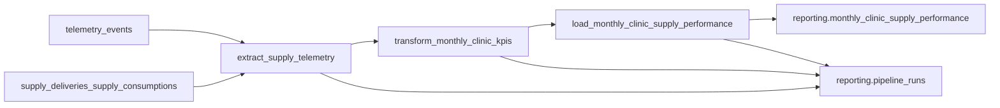

# PIPELINE_DESIGN — Monthly Clinic Supply Performance

Business performance pipeline for HealthCore (design only — Part 1).  
Orchestration code, DDL application, and `services/reporting/` implementation belong to Parts 2–3.

_These instructions are [available in Spanish](./PIPELINE_DESIGN.es.md)._

**Source of truth:** [`docs/data-pipelines/CONTEXT-healthcore-phase-1.md`](../../docs/data-pipelines/CONTEXT-healthcore-phase-1.md)  
**Telemetry floor:** [`docs/telemetry/CONTEXT-healthcore.md`](../../docs/telemetry/CONTEXT-healthcore.md)

**Out of scope for this pipeline (do not modify):**

- `services/app/domain/telemetry_analysis.py`
- `GET /telemetry/report`
- Writing any result into `telemetry_events` (read-only source)

**Allowed telemetry extension:** additive `unit_cost` on existing mandatory event `inbound_order_created` (supply cost only — never PHI).

---

## 1. Current State

### 1.1 What already exists

| Layer | Artifact | Role today |
| --- | --- | --- |
| Capture | `uis/backoffice/lib/services/telemetry.ts` (`track()`) | In-memory queue, batch flush, `sendBeacon`, exponential backoff retry |
| Instrumentation | Inventory forms + related UI | Mandatory events: `inbound_order_created`, `outbound_order_created`, `stock_threshold_triggered`, `supply_expiry_flagged`, plus technical/auth events |
| Ingest | `POST /telemetry/events` → `services/app/domain/telemetry_service.py` | Per-event Pydantic validate, allowlist filter into `tags`, bulk insert |
| Storage | Supabase table `telemetry_events` | Append-oriented fact rows: `event_id`, `timestamp`, `event_type`, `service`, `user_id`, `session_id`, `tags` (JSONB) |
| Technical report | `GET /telemetry/report` + `telemetry_analysis.py` | Engineering metrics: events/day, error rates, latency by path, `auth_failure_rate` (default last 7 days UTC) |
| Domain inventory | `medical_supplies`, `supply_deliveries`, `supply_consumptions` | Operational truth for stock movements (no cost field on deliveries today) |

Envelope fields relevant to this design: `eventId` → column `event_id`, `timestamp`, `event_type`, `requestId`, `properties` → allowlisted `tags`.

Domain identifiers already used in this monorepo: `clinic_id` integer **1–12**, `country` `US` \| `UK`, `product_id`, `product_category`, `quantity`, `department` (outbound only — clinical area, never a patient id).

### 1.2 Business gap

The technical report answers **engineering** questions (volume, errors, latency). It does **not** answer the board question Dr. Okonkwo and Claire Whitfield need:

> For each of the 12 clinics, in a given calendar month, what was supply spend, consumption activity, critical stockout frequency, and expiry-risk flag count — split by US (`USD`) and UK (`GBP`), with no FX conversion and no PHI?

That deliverable is the **Monthly Clinic Supply Performance Report**. Closing the gap requires a dedicated ETL into `reporting.monthly_clinic_supply_performance`, exposed by a new `services/reporting/` module — not an extension of `GET /telemetry/report`.

### 1.3 Known ingest gap (to close in Part 2)

`telemetry_events` currently has **no unique constraint on `event_id`**. Duplicate client retries can insert two rows with the same `eventId`. This design treats upsert-on-`event_id` at ingest as a Part 2 hardening item, and still deduplicates by `event_id` in the transform layer for safety.

---

## 2. Pipeline Purpose and Design

### 2.1 Purpose (one sentence)

Produce the monthly consolidated feed that powers Dr. Okonkwo’s **Monthly Clinic Supply Performance Report**, computing **Supply Cost per Clinic**, **Supply Consumption Volume**, **Critical Stockout Frequency**, and **Expiry Risk Count** from mandatory telemetry `inbound_order_created`, `outbound_order_created`, `stock_threshold_triggered`, and `supply_expiry_flagged`.

| Attribute | Value |
| --- | --- |
| Audience | Dr. Okonkwo (CEO), Claire Whitfield (Chief Compliance Officer) |
| Cadence | Monthly — ready by the first working day of the month (UTC) |
| Grain | One row per `clinic_id` × `month_start` (first day of month, UTC) |
| Dimensions | `clinic_id` (text of integer 1–12), `country` (`US`/`UK`), `month_start`, `currency` (`USD`/`GBP`) |
| Destination | `reporting.monthly_clinic_supply_performance` |
| Exposure | `services/reporting/` — never `services/telemetry/` |

### 2.2 KPI ↔ event mapping

| KPI | Computed field | Source `event_type` | Aggregation |
| --- | --- | --- | --- |
| Supply Cost per Clinic | `total_supply_cost` | `inbound_order_created` | `sum(unit_cost * quantity)` for the month |
| Supply Consumption Volume | `supply_consumption_count` | `outbound_order_created` | Count of events (deduped by `event_id`) |
| Critical Stockout Frequency | `critical_stockout_count` | `stock_threshold_triggered` | Count of events |
| Expiry Risk Count | `expiry_risk_count` | `supply_expiry_flagged` | Count of events |

`currency`: `USD` when `country = US`, `GBP` when `country = UK`. Never sum USD and GBP into one row.

v1 does **not** grain by `department` — CONTEXT unique key is `(clinic_id, month_start)` only. Department may appear in source tags for consumption events but is not a reporting dimension in v1.

### 2.3 Extraction format

**Primary source:** `telemetry_events` (read-only).

| Aspect | Specification |
| --- | --- |
| Filter | `event_type IN ('inbound_order_created','outbound_order_created','stock_threshold_triggered','supply_expiry_flagged')` |
| Window | All events with `timestamp` in `[month_start, next_month_start)` UTC for the target month (re-runs may widen slightly to catch late arrivals within policy) |
| Payload shape | Row columns + `tags` JSONB: `clinic_id`, `country`, `quantity`, `unit_cost` (inbound), `product_id`, etc. |
| Source freshness | Near real-time appends from `POST /telemetry/events` (batch flush ~3–10s from the browser) |
| Pipeline freshness | Scheduled monthly + on-demand manual trigger |

**Coverage / sanity source (optional join, not KPI truth):** count `supply_deliveries` / `supply_consumptions` by `clinic_id` and calendar month to detect capture gaps. No patient tables. No PHI.

### 2.4 Data flow (Extract → Transform → Load)



**Extract (`extract_supply_telemetry`)**

1. Resolve target `month_start` (default: previous calendar month UTC).
2. Acquire month lock (see §3.4 concurrency).
3. Insert/update `reporting.pipeline_runs` with `status=running`, `phase=extract`.
4. SELECT filtered events + optional domain coverage counts.
5. Record `records_extracted`, `window_start`, `window_end`, `source_max_timestamp`.

**Transform (`transform_monthly_clinic_kpis`)**

1. `phase=transform`.
2. Drop duplicate rows by `event_id` (keep first by `timestamp`).
3. Derive `month_start = date_trunc('month', timestamp AT TIME ZONE 'UTC')::date`.
4. Cast `tags->>'clinic_id'` → text clinic id; validate `1..12`.
5. For inbound: `line_cost = coalesce((tags->>'unit_cost')::numeric, 0) * coalesce((tags->>'quantity')::numeric, 0)`.
6. Group by `clinic_id`, `country`, `month_start` → KPI columns + `currency`.
7. Emit one DataFrame/list of dicts ready for upsert.

**Load (`load_monthly_clinic_supply_performance`)**

1. `phase=load`.
2. `INSERT ... ON CONFLICT (clinic_id, month_start) DO UPDATE` setting KPI columns and `computed_at = now()`.
3. Mark run `status=completed`, set `finished_at`, `records_processed`.

### 2.5 Handling updates to “existing” records

Telemetry facts are append-only. What changes over time is the **monthly aggregate** when late events arrive or a month is recomputed.

**Strategy:** upsert on natural key `(clinic_id, month_start)` — the same unique constraint defined in CONTEXT. Never append a second KPI row for the same clinic-month. Re-running the pipeline for July replaces July’s numbers with a full recomputation from source, not a delta append.

### 2.6 Destination table (exact name)

```sql
create schema if not exists reporting;

create table reporting.monthly_clinic_supply_performance (
  id uuid primary key default gen_random_uuid(),
  clinic_id text not null,
  country text not null,
  month_start date not null,
  total_supply_cost numeric not null default 0,
  supply_consumption_count integer not null default 0,
  critical_stockout_count integer not null default 0,
  expiry_risk_count integer not null default 0,
  currency text not null,
  computed_at timestamptz not null default now(),
  unique (clinic_id, month_start)
);
```

### 2.7 Additive telemetry field: `unit_cost`

Without a cost on `inbound_order_created`, Supply Cost per Clinic cannot be computed. Part 1 extends the existing event (not a new type):

- Schema: `properties.unit_cost` number ≥ 0, required; added to `x-allowlist` so `filter_tags` persists it in `tags`.
- Capture: inbound form collects unit cost and passes it to `track("inbound_order_created", …)`.
- Domain: cost lives in telemetry for v1; `SupplyDelivery` ORM is unchanged.

---

## 3. Resilience, Idempotency, Observability

### 3.1 Idempotency strategy (failed mid-load → re-run)

**Scenario:** 02:00 run loaded 847 of 1,412 clinic-month rows then timed out on Supabase.

**On re-run:**

1. Transform recomputes the full month from `telemetry_events` (deduped by `event_id`).
2. Load upserts every `(clinic_id, month_start)` row.
3. Rows already inserted are **updated** to the same values; missing rows are inserted.
4. Result equals a clean run — no double-counting, no orphan partial appends.

Watermark / checkpoint: `reporting.pipeline_runs.phase` records last successful phase. After a load failure, the next run may skip re-extract only if `source_max_timestamp` and extract checksum are unchanged; default v1 behaviour is **safe full recompute of the month** plus upsert.

### 3.2 Execution log — `reporting.pipeline_runs`

Minimum fields (name, type, why):

| Field | Type | Why it is required for audit |
| --- | --- | --- |
| `run_id` | `uuid` | Stable identity for the attempt; correlates with Prefect flow run id and API responses |
| `started_at` | `timestamptz` | Proves the pipeline ran (distinguishes “no run” from “ran with zeros”) |
| `finished_at` | `timestamptz` nullable | Duration, hang detection, SLA for first working day |
| `status` | `text` (`running` \| `completed` \| `failed`) | Observable outcome for `GET /reporting/pipeline-runs/latest` |
| `records_processed` | `integer` | Volume signal — compare against expected clinic count and source event volume |
| `error_message` | `text` nullable | Root cause when `failed` |
| `phase` | `text` (`extract` \| `transform` \| `load`) | Checkpoint for recoverability |
| `month_start` | `date` | Which board month this run targeted |
| `window_start` / `window_end` | `timestamptz` | Exact extract window for late-event forensics |
| `pipeline_name` | `text` | Distinguishes this job from future reporting pipelines |

### 3.3 Rubric scenarios (concrete answers for this monorepo)

#### Idempotency — duplicate source events

An operator confirms outbound twice in 300 ms; two HTTP deliveries share the same `eventId` but different receive times.

- **Dedup key:** envelope `eventId` → column `event_id`.
- **Ingest layer (Part 2):** `UNIQUE (event_id)` + `INSERT … ON CONFLICT (event_id) DO NOTHING` (or update metadata only). Return **200** when the event already exists (“already stored”).
- **Transform layer (always):** `drop_duplicates(subset=['event_id'])` before KPI aggregation so historical duplicates already in the table do not inflate counts.

#### Idempotency — retry after partial load

See §3.1 — upsert on `(clinic_id, month_start)`.

#### Idempotency — late events

A delayed `inbound_order_created` for July arrives on 3 August.

1. Manual or scheduled recompute with `month_start=2026-07-01`.
2. Full re-aggregate July from source; upsert replaces prior `total_supply_cost`.
3. New `pipeline_runs` row + updated `computed_at` preserve audit trail without appending a second July row.

#### Observability — silence vs true zero

- **No row in `pipeline_runs` for the month** ⇒ pipeline never ran (or failed before insert) — not “clinics spent $0”.
- **Completed run with `supply_consumption_count = 0` for clinic 5** ⇒ zero qualifying events after dedupe for that clinic-month.
- **Heartbeat:** track `last_successful_ingest_at` (max `telemetry_events.timestamp` or ingest counter). Alert if domain `supply_consumptions` for clinic X in the month exist but telemetry has zero `outbound_order_created` for that clinic (capture failure, not quiet business).

#### Observability — collection traceability

Spike at 09:00 then flat at 09:15:

- Persist `run_id`, extract `window_start`/`window_end`, `records_extracted`, `source_max_timestamp`.
- Correlate envelope `requestId` on raw events with the batch that produced them; correlate Prefect / API `run_id` with the aggregate refresh.
- Detect “two windows batched at once” when `window_end - window_start` exceeds the expected month span or when `records_extracted` jumps without matching domain activity.

#### Observability — growth vs data loss

Monday 12,000 events vs Sunday 800 may be normal clinic patterns. Compare:

- Telemetry counts of `inbound_order_created` / `outbound_order_created` per clinic-day
- vs row counts in `supply_deliveries` / `supply_consumptions` for the same clinic-day

Large divergence ⇒ capture or ingest failure, not business growth. Use clinic coverage (how many of 1–12 reported) as a second signal.

#### Recoverability — database drop mid-pipeline

Pandas finished grouping; INSERT to reporting failed.

- `pipeline_runs.phase = 'load'`, `status = 'failed'`, `error_message` set.
- Next run: upsert load again (idempotent). Optional: resume from `phase=load` with cached transform artifact under `data/process/` keyed by `run_id` (Part 2/3); Part 1 default is recompute + upsert.

#### Recoverability — frontend offline buffer

Current design: **in-memory queue only** (existing TelemetryService). IndexedDB / durable offline buffer is **out of scope** for v1 supply KPIs:

- Risk of clock skew, duplicate flush after crash, and longer retention of session identifiers.
- Supply board metrics tolerate minutes of delay; they do not justify durable browser buffering.
- Retries must keep the **same `eventId`** for each logical action so ingest upsert stays idempotent.

#### Recoverability — POST /telemetry retry

| Server outcome | Client action |
| --- | --- |
| 200 and row stored (or already exists via `event_id` upsert) | Success — do not retry |
| Timeout / 5xx | Retry with same payload / same `eventId` (existing backoff) |
| 4xx validation | Do not retry; drop or log |

Idempotency-Key semantics = stable `eventId` in the body (and optionally mirrored as header in Part 2).

#### Cross-cutting — concurrent runs

Scheduled 02:00 flow overlaps with “Run pipeline now” at 02:05.

- **Lock:** Postgres advisory lock or a `running` row unique on `(pipeline_name, month_start)`.
- Second caller receives **409 Conflict** from `POST /reporting/pipeline-runs` (or waits briefly then fails).
- Each attempt still gets a unique `run_id`; only one load writer holds the month lock.

---

## 4. Prefect Mapping

### 4.1 Main flow

**`monthly_clinic_supply_performance_flow`**

- Parameters: `month_start: date | None` (default = previous UTC month).
- Lives under `data/pipelines/` (implementation in Part 2).
- States of interest:
  - **Running** — lock acquired; `pipeline_runs.status=running`
  - **Completed** — upsert done; `status=completed`
  - **Failed** — exception; `status=failed`, `phase` + `error_message` set; do not mark Completed

### 4.2 Tasks (minimum three)

| Task | Stage | Responsibility |
| --- | --- | --- |
| `extract_supply_telemetry` | Extract | Read `telemetry_events` (+ optional domain coverage) for the month window |
| `transform_monthly_clinic_kpis` | Transform | Dedupe `event_id`, aggregate four KPIs per clinic-month |
| `load_monthly_clinic_supply_performance` | Load | Upsert into `reporting.monthly_clinic_supply_performance` |

Reusable pure transforms may live in `data/process/` (e.g. `data/process/reporting/monthly_clinic_kpis.py`) and be imported by tasks — not by routers.

### 4.3 Optional second flow (documented for Part 3)

**`backfill_monthly_clinic_supply_performance_flow`** — loops `month_start` over a range, calling the same three tasks (or subflows in Part 3). Not required to implement in Part 1.

### 4.4 Prefect blocks

| Block | Purpose |
| --- | --- |
| Supabase / Postgres credentials | Same `SUPABASE_DB_*` or `DATABASE_URL` used by inventory/telemetry — never committed to the repo |
| Optional Slack/email notify | Alert on `Failed` or silent ingest (Part 3+) |

---

## 5. Application Integration (design only)

New module **`services/reporting/`**, mounted from the FastAPI app in Part 2. HTTP layer imports callables from `data/pipelines/` — **no ETL logic inside services**.

| Endpoint | Behaviour | Imports from `data/pipelines/` |
| --- | --- | --- |
| `GET /reporting/pipeline-runs/latest` | Status + metadata of the latest run | `get_latest_pipeline_run()` |
| `POST /reporting/pipeline-runs` | Manual trigger (`month_start` optional); acquires lock; starts flow | `trigger_monthly_clinic_supply_performance_run()` |
| `GET /reporting/monthly-clinic-supply-performance` | KPI feed for the board / Part 3 dashboard; optional `month_start` (default latest computed month) | `query_monthly_clinic_supply_performance(month_start?)` |

Example response shape (CONTEXT):

```json
{
  "month_start": "2026-07-01",
  "clinics": [
    {
      "clinic_id": "3",
      "country": "US",
      "total_supply_cost": 18420.50,
      "supply_consumption_count": 340,
      "critical_stockout_count": 1,
      "expiry_risk_count": 4,
      "currency": "USD"
    }
  ]
}
```

Note: monorepo domain uses numeric clinic ids `1`–`12` (serialized as text in reporting). Do not invent slug ids such as `austin-north` in implementation.

### 5.1 Separation from telemetry

| Concern | Module |
| --- | --- |
| Capture + technical report | `services/app/routers/telemetry.py`, `telemetry_analysis.py` |
| Business KPIs + pipeline control | `services/reporting/` → `data/pipelines/` |
| Fact store | `telemetry_events` (source only) |
| KPI store | `reporting.monthly_clinic_supply_performance` |

### 5.2 Compliance

- No patient identifiers, diagnoses, or PHI in table, endpoint, or logs.
- Aggregate at clinic / month only.
- Do not mix currencies in a single aggregate row.

---

## 6. Implementation roadmap (Parts 2–3)

| Part | Work |
| --- | --- |
| Part 1 (this doc) | Design + additive `unit_cost` on `inbound_order_created` |
| Part 2 | Prefect flow/tasks, DDL, ingest upsert on `event_id`, `services/reporting/` endpoints |
| Part 3 | Subflows, tests, backoffice dashboard consuming `GET /reporting/monthly-clinic-supply-performance` |

### 6.1 Part 2 Phase 2 — resilience (implemented)

| Mechanism | Where | Notes |
| --- | --- | --- |
| Retries | `extract_supply_telemetry`, `load_monthly_clinic_supply_performance` | `retries=3`, `retry_delay_seconds=10` — transient Supabase/network |
| Cache | `transform_monthly_clinic_kpis` | `cache_key_fn=task_input_hash` (events + `month_start`); `cache_expiration=1 hour` |
| Explicit failure handling | Flow | `load_…(return_state=True)` fails the flow if not completed; `write_eval_snapshot(return_state=True)` is non-critical |

**Cadence:** monthly (first working day UTC).  
**CLI:** `PYTHONPATH=. uv run python data/pipelines/pipeline.py`

### 6.2 Part 2 Phase 3 — idempotency + run log (implemented)

- **Load:** `INSERT … ON CONFLICT (clinic_id, month_start) DO UPDATE` — two runs over the same month leave one row per clinic with the same KPI values.
- **Audit table:** `reporting.pipeline_runs` stores at least `run_id`, `started_at`, `finished_at`, `status`, `records_processed`, plus `phase`, `records_extracted`, `error_message`, `month_start`, window bounds.
- **Helper:** `get_latest_pipeline_run()` reads the newest run for upcoming `GET /reporting/pipeline-runs/latest`.

---

## 7. Traceability checklist

- [x] Current State + business gap documented
- [x] Purpose names the Monthly Clinic Supply Performance Report and all four CONTEXT KPIs
- [x] Extraction format (tables, payload, cadence) specified
- [x] ETL diagram with real entity/table names
- [x] Upsert strategy for monthly aggregates
- [x] Destination `reporting.monthly_clinic_supply_performance` (exact CONTEXT name)
- [x] Idempotency after mid-load failure described concretely
- [x] Execution log ≥ five fields with types and justification
- [x] Prefect: one main flow + three tasks + Running/Completed/Failed
- [x] Three reporting endpoints mapped to `data/pipelines/` functions
- [x] Technical telemetry path left unchanged; `telemetry_events` is source only
