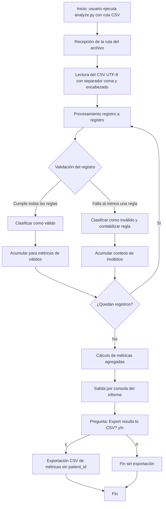

# Diseño funcional — Flujo de ejecución de `analyze.py`

**Fuente de verdad:** `docs/data-contract/CONTEXT-HealthCore.es.md`  
**Alcance:** Paso 1 — diseño funcional únicamente (sin código, sin estructura de proyecto, sin Fase 2)

---

## Objetivo del flujo

Procesar un archivo CSV de reportes de incidentes de pacientes de HealthCore, clasificar cada registro como válido o inválido según reglas de negocio, calcular métricas agregadas **sin exponer identificadores de paciente** (`patient_id`), mostrar un informe por consola y, al final, preguntar al usuario si desea exportar esas métricas a un CSV.

El caso de uso de referencia es:

```text
python analyze.py incidents-healthcore.csv
```

---

## Diagrama del flujo



```text
[Inicio]
   |
   v
Recepcion ruta CSV  -->  Lectura CSV  -->  Por cada registro:
                                              |
                                              +--> Validar
                                              |      |
                                              |      +--> Valido   --> acumular metricas base
                                              |      +--> Invalido --> acumular regla(s)
                                              |
                                         (fin registros)
                                              |
                                              v
                                    Calcular metricas agregadas
                                              |
                                              v
                                    Imprimir informe en consola
                                              |
                                              v
                                    ¿Exportar CSV? [y/n]
                                         /         \
                                       y             n
                                       |             |
                                       v             v
                                 Exportar CSV      Terminar
                                 de metricas
                                       |
                                       v
                                    Terminar
```

---

## Descripción paso a paso

### 1. Arranque e entrada

El usuario ejecuta el programa pasando la ruta del CSV (ejemplo: `incidents-healthcore.csv`).

**Entrada:** ruta del archivo CSV.  
**Salida de esta etapa:** disponibilidad del archivo para lectura.

### 2. Lectura del archivo

Se lee el CSV con:

- Codificación UTF-8  
- Separador `,`  
- Fila 1 = encabezado  

Campos esperados: `incident_id`, `date`, `clinic_id`, `country`, `category`, `description`, `status`, `patient_id`, `satisfaction_score`.

**Entrada:** archivo CSV.  
**Salida:** conjunto de registros listos para validar (incluye filas de datos; el total de filas del archivo de prueba de referencia es 100).

### 3. Validación de cada registro

Cada registro se evalúa contra las reglas de invalidez. Un registro es **inválido** si ocurre **cualquiera** de:

| Regla | Condición |
| --- | --- |
| `clinic_id` faltante o inválido | Vacío o fuera de los 12 códigos válidos |
| Incompatibilidad país/clínica | `country` no coincide con el país del `clinic_id` |
| `category` faltante o inválida | Vacía o fuera de las 5 categorías válidas |
| `description` vacía / corta | Vacía o con menos de 5 caracteres |
| Falta `patient_id` | Vacío o no cumple formato `PAT-XXXXXX` |
| `CLOSED` sin score | `status = CLOSED` y sin `satisfaction_score` |
| Score fuera de rango | Hay `satisfaction_score` y no está entre 1 y 5 inclusive |

**Punto de validación:** aquí, **antes** del cálculo de métricas de negocio y **antes** de cualquier salida. Solo los registros que pasan todas las reglas cuentan como válidos.

**Restricción de cumplimiento (transversal):** si `patient_id` es inválido, se reporta solo la regla y el conteo (p. ej. “Missing patient_id: N records”); **nunca** el valor. Ningún `patient_id` puede aparecer en consola, logs ni exportación.

**Entrada:** un registro.  
**Salida:** clasificación válido/inválido +, si es inválido, contribución al conteo de la(s) regla(s) activada(s).

### 4. Separación de conjuntos

Tras validar todos los registros:

- Conjunto **válido** → base de las métricas de categoría, estado, país (recomendado) y satisfacción.  
- Conjunto **inválido** → base del desglose de reglas.  
- **Total** = válidos + inválidos (en el archivo de prueba: 100 = 94 + 6).

### 5. Cálculo de métricas

**Punto de cálculo:** después de validar **todos** los registros y **antes** de imprimir el informe.

Métricas derivadas del CONTEXT:

| Bloque | Base | Contenido |
| --- | --- | --- |
| Totales | Todos | Total, válidos, inválidos/incompletos |
| Desglose de inválidos | Inválidos | Conteo por cada regla de la tabla |
| Por categoría | Solo válidos | Conteos y porcentajes por las 5 categorías |
| Por estado | Solo válidos | `OPEN`, `CLOSED`, `DISCARDED` (+ %) |
| Por país | Solo válidos | `US` / `UK` (+ %) — **recomendado, no obligatorio para aprobar** |
| Satisfacción | Casos `CLOSED` válidos con score | Casos puntuados, promedio, histograma 1–5 |

En el archivo de prueba de referencia, el promedio esperado es **3.58** sobre 52 casos cerrados puntuados.

**Entrada:** conjuntos válido/inválido.  
**Salida:** estructura de métricas lista para mostrar/exportar (sin PHI).

### 6. Salida por consola

**Punto de generación de salida:** después del cálculo de métricas y **antes** de la pregunta de exportación.

Secciones **obligatorias:**

1. Encabezado (`HEALTHCORE — PATIENT INCIDENT REPORT ANALYSIS` + nombre del archivo fuente)  
2. Totales  
3. `INVALID RECORDS BREAKDOWN`  
4. `BREAKDOWN BY CATEGORY`  
5. `BREAKDOWN BY STATUS`  
6. `SATISFACTION INDEX`  

Sección **recomendada** (no obligatoria para aprobar):

1.n `BREAKDOWN BY COUNTRY`

Se aceptan diferencias menores de formato; los valores numéricos de las secciones obligatorias deben coincidir exactamente con el archivo de prueba.

**Entrada:** métricas calculadas + nombre del archivo fuente.  
**Salida:** informe impreso en consola (sin `patient_id`).

### 7. Pregunta de exportación CSV

**Punto de la pregunta:** inmediatamente **después** del informe de consola, como última interacción del flujo mostrado en el CONTEXT:

```text
Export results to CSV? [y / n]:
```

- Si la respuesta es afirmativa (`y`): se exporta un CSV de métricas.  
- Si es negativa (`n`): el programa termina sin exportar.

### 8. Exportación CSV (condicional)

Según James Osei: una fila por métrica; columnas `metric`, `value` y opcionalmente `percentage`. Destino de uso: hoja de reporte del equipo de facturación. La exportación **no** puede incluir `patient_id` ni otros datos personales.

**Entrada:** métricas ya calculadas + confirmación del usuario.  
**Salida:** archivo CSV de métricas agregadas (o ninguna, si el usuario rechaza).

### 9. Terminación

El programa finaliza tras la respuesta a la exportación (con o sin archivo generado).

---

## Responsabilidades de cada etapa

| Etapa | Responsabilidad |
| --- | --- |
| Arranque / entrada | Recibir la ruta del CSV indicada por el usuario |
| Lectura | Cargar el archivo con la estructura y formato definidos (UTF-8, `,`, encabezado) |
| Validación | Aplicar las reglas de invalidez; contar por tipo de regla; proteger `patient_id` en todo momento |
| Separación | Distinguir válidos vs inválidos/incompletos |
| Cálculo de métricas | Agregar totales, desgloses y satisfacción solo sobre la base correcta (válidos o inválidos según el bloque) |
| Salida por consola | Presentar el informe obligatorio (+ país recomendado) sin PHI |
| Pregunta de exportación | Solicitar confirmación interactiva `[y / n]` |
| Exportación CSV | Si se confirma, escribir métricas en formato `metric` / `value` / `percentage` opcional, sin datos de paciente |
| Terminación | Cerrar el flujo de forma limpia |

---

## Respuestas directas a las preguntas del Paso 1

1. **¿Qué ocurre de extremo a extremo?** Se lee el CSV → se valida cada registro → se calculan métricas → se imprime el informe → se pregunta si exportar → según la respuesta se exporta o no → termina.  
2. **Etapas principales:** entrada → lectura → validación → cálculo → consola → prompt de exportación → (opcional) exportación → fin.  
3. **Responsabilidad de cada etapa:** ver tabla anterior.  
4. **Entradas/salidas:** ver cada paso de la descripción.  
5. **Validación:** por registro, tras la lectura y antes del cálculo de métricas y de cualquier salida.  
6. **Cálculo de métricas:** cuando ya están clasificados todos los registros; antes de imprimir.  
7. **Salida por consola:** después de las métricas; antes del prompt de exportación.  
8. **Pregunta de exportar CSV:** al final del informe de consola, como última interacción del flujo documentado.

---

## Observaciones importantes de CONTEXT-HealthCore.es.md (impacto en implementación futura)

1. **Cumplimiento no negociable:** cero exposición de `patient_id` (ni en errores). Si se imprime, la salida no es usable (Priya / Claire / James).  
2. **Datos no enviables a IA externa:** el CSV contiene PHI / datos personales bajo HIPAA y UK GDPR.  
3. **`satisfaction_score`:** opcional en esquema, pero obligatorio si `status = CLOSED`; sin él el registro es incompleto/inválido.  
4. **Consistencia `country` ↔ `clinic_id`:** invalida el registro aunque ambos campos existan.  
5. **Métricas de categoría/estado/país/satisfacción:** sobre registros **válidos** (satisfacción sobre cerrados puntuados).  
6. **`BREAKDOWN BY COUNTRY`:** recomendado para stakeholders HealthCore; no obligatorio para aprobar según la rúbrica del README del proyecto (referenciada en el CONTEXT).  
7. **Exportación:** filas de métricas (`metric`, `value`, `percentage` opcional), no filas de incidentes.  
8. **Archivo de prueba de referencia:** totales y desgloses fijados (100 / 94 / 6, etc.); la salida obligatoria debe reproducir esos números.  
9. **ACCESSIBILITY** es prioritaria para Priya (señal de negocio; el flujo funcional no exige un bloque extra por clínica de Florida más allá de lo ya definido).

---

## Requisitos ambiguos o faltantes (explícitos)

No inventados; pendientes de aclaración antes de implementar:

| ID | Ambigüedad |
| --- | --- |
| A1 | El CONTEXT habla de **1,000 filas** en la introducción y de **100 filas** en la distribución del archivo de prueba. |
| A2 | El esquema nombra el archivo `incidents.csv`; el comando de referencia usa `incidents-healthcore.csv`. |
| A3 | `incident_id` y `date` son requeridos en la tabla de estructura, pero **no** aparecen en la tabla de reglas de invalidez. |
| A4 | No se indica qué ocurre si un mismo registro viola **varias** reglas a la vez (¿una sola regla? ¿todas?). |
| A5 | No se define el orden de evaluación de las reglas. |
| A6 | No se especifica el nombre ni la ruta del CSV exportado. |
| A7 | No se detalla el comportamiento ante archivo inexistente, ruta inválida o argumentos ausentes. |
| A8 | No se define qué respuestas distintas de `y`/`n` se aceptan (mayúsculas, otras cadenas). |
| A9 | El contenido exacto de cada fila `metric` del CSV exportado no está listado campo a campo. |
| A10 | La rúbrica del README del proyecto se menciona pero no está incluida en este CONTEXT; el alcance de “obligatorio vs recomendado” se toma solo de lo escrito aquí. |

---

**Fin del Paso 1.** Listo para nuevas instrucciones (Fase 2 u otras) cuando indiques.
