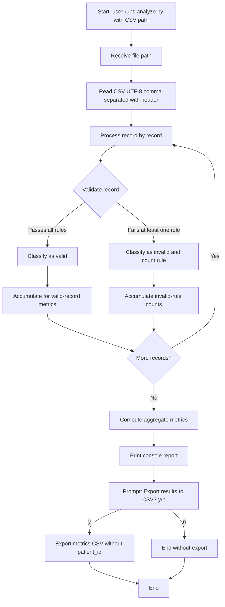

# Functional Design — Execution Flow of `analyze.py`

**Source of truth:** `docs/data-contract/CONTEXT-HealthCore.es.md` (business requirements; English twin: `CONTEXT-HealthCore.md`)  
**Scope:** Step 1 — functional design only (no code, no project structure, no Phase 2)

**Suggested path (when you save it):** `docs/data-contract/functional-design-analyze.md`

---

## Flow objective

Process a CSV file of HealthCore patient incident reports, classify each record as valid or invalid under the business rules, compute aggregate metrics **without exposing patient identifiers** (`patient_id`), print a console report, and finally ask the user whether to export those metrics to a CSV.

Reference invocation:

```text
python analyze.py incidents-healthcore.csv
```

---

## Flow diagram



```text
[Start]
   |
   v
Receive CSV path  -->  Read CSV  -->  For each record:
                                          |
                                          +--> Validate
                                          |      |
                                          |      +--> Valid   --> accumulate metric base
                                          |      +--> Invalid --> accumulate rule count(s)
                                          |
                                     (end of records)
                                          |
                                          v
                                 Compute aggregate metrics
                                          |
                                          v
                                 Print console report
                                          |
                                          v
                                 Export to CSV? [y/n]
                                      /         \
                                    y             n
                                    |             |
                                    v             v
                              Export metrics    Exit
                              CSV
                                    |
                                    v
                                  Exit
```

---

## Step-by-step description

### 1. Startup and input

The user runs the program with the CSV path (example: `incidents-healthcore.csv`).

**Input:** CSV file path.  
**Output of this stage:** file available for reading.

### 2. File reading

Read the CSV with:

- Encoding UTF-8  
- Separator `,`  
- Row 1 = header  

Expected fields: `incident_id`, `date`, `clinic_id`, `country`, `category`, `description`, `status`, `patient_id`, `satisfaction_score`.

**Input:** CSV file.  
**Output:** records ready for validation (reference test file: 100 data rows).

### 3. Per-record validation

Each record is checked against the invalidity rules. A record is **invalid** if **any** of the following holds:

| Rule | Condition |
| --- | --- |
| Missing or invalid `clinic_id` | Empty or not one of the 12 valid codes |
| Country/clinic mismatch | `country` does not match the country of `clinic_id` |
| Missing or invalid `category` | Empty or not one of the 5 valid categories |
| Empty / short `description` | Empty or fewer than 5 characters |
| Missing `patient_id` | Empty or not matching `PAT-XXXXXX` |
| `CLOSED` without score | `status = CLOSED` and no `satisfaction_score` |
| Score out of range | `satisfaction_score` present but not in 1–5 inclusive |

**Validation point:** here, **before** business metrics and **before** any output. Only records that pass all rules count as valid.

**Compliance constraint (cross-cutting):** if `patient_id` is invalid, report only the rule and count (e.g. “Missing patient_id: N records”); **never** the value. No `patient_id` may appear in console, logs, or export.

**Input:** one record.  
**Output:** valid/invalid classification and, if invalid, contribution to the activated rule count(s).

### 4. Set separation

After all records are validated:

- **Valid** set → base for category, status, country (recommended), and satisfaction metrics.  
- **Invalid** set → base for the rule breakdown.  
- **Total** = valid + invalid (reference file: 100 = 94 + 6).

### 5. Metric calculation

**Calculation point:** after **all** records are validated and **before** printing the report.

Metrics from CONTEXT:

| Block | Base | Content |
| --- | --- | --- |
| Totals | All | Total, valid, invalid/incomplete |
| Invalid breakdown | Invalid | Count per rule in the table |
| By category | Valid only | Counts and % for the 5 categories |
| By status | Valid only | `OPEN`, `CLOSED`, `DISCARDED` (+ %) |
| By country | Valid only | `US` / `UK` (+ %) — **recommended, not required to pass** |
| Satisfaction | Valid `CLOSED` with score | Scored cases, average, histogram 1–5 |

Reference test file: average **3.58** over 52 scored closed cases.

**Input:** valid/invalid sets.  
**Output:** metrics structure ready to display/export (no PHI).

### 6. Console output

**Output generation point:** after metric calculation and **before** the export prompt.

**Required** sections:

1. Header (`HEALTHCORE — PATIENT INCIDENT REPORT ANALYSIS` + source file name)  
2. Totals  
3. `INVALID RECORDS BREAKDOWN`  
4. `BREAKDOWN BY CATEGORY`  
5. `BREAKDOWN BY STATUS`  
6. `SATISFACTION INDEX`  

**Recommended** section (not required to pass):

7. `BREAKDOWN BY COUNTRY`

Minor formatting differences are acceptable; numeric values in required sections must match the test file exactly.

**Input:** computed metrics + source file name.  
**Output:** console report (no `patient_id`).

### 7. CSV export prompt

**Prompt point:** immediately **after** the console report, as the last interaction shown in CONTEXT:

```text
Export results to CSV? [y / n]:
```

- Affirmative (`y`): export a metrics CSV.  
- Negative (`n`): exit without export.

### 8. CSV export (conditional)

Per James Osei: one row per metric; columns `metric`, `value`, and optionally `percentage`. Intended for Tom’s billing reporting spreadsheet. Export **must not** include `patient_id` or other personal data.

**Input:** computed metrics + user confirmation.  
**Output:** metrics CSV file (or none if declined).

### 9. Termination

The program ends after the export response (with or without a generated file).

---

## Stage responsibilities

| Stage | Responsibility |
| --- | --- |
| Startup / input | Receive the CSV path from the user |
| Reading | Load the file with the defined structure and format (UTF-8, `,`, header) |
| Validation | Apply invalidity rules; count by rule type; protect `patient_id` at all times |
| Separation | Distinguish valid vs invalid/incomplete |
| Metric calculation | Aggregate totals, breakdowns, and satisfaction on the correct base (valid or invalid per block) |
| Console output | Present the required report (+ recommended country) without PHI |
| Export prompt | Ask for interactive confirmation `[y / n]` |
| CSV export | If confirmed, write metrics as `metric` / `value` / optional `percentage`, with no patient data |
| Termination | End the flow cleanly |

---

## Direct answers to Step 1 questions

1. **End-to-end?** Read CSV → validate each record → compute metrics → print report → ask to export → export or skip → exit.  
2. **Main stages:** input → read → validate → compute → console → export prompt → (optional) export → end.  
3. **Responsibilities:** see table above.  
4. **Inputs/outputs:** see each step.  
5. **Validation:** per record, after reading and before metrics and any output.  
6. **Metrics:** after all records are classified; before printing.  
7. **Console output:** after metrics; before the export prompt.  
8. **Export prompt:** at the end of the console report, as the last documented interaction.

---

## Important notes from CONTEXT (implementation impact)

1. **Non-negotiable compliance:** zero `patient_id` exposure (including errors). If printed, the output is unusable (Priya / Claire / James).  
2. **No external AI tools:** CSV contains PHI / personal data under HIPAA and UK GDPR.  
3. **`satisfaction_score`:** optional in schema, required when `status = CLOSED`; without it the record is incomplete/invalid.  
4. **`country` ↔ `clinic_id` consistency:** invalidates the record even if both fields are present.  
5. **Category/status/country/satisfaction metrics:** on **valid** records (satisfaction on scored closed cases).  
6. **`BREAKDOWN BY COUNTRY`:** recommended for HealthCore stakeholders; not required to pass per the project README rubric (as referenced in CONTEXT).  
7. **Export:** metric rows (`metric`, `value`, optional `percentage`), not incident rows.  
8. **Reference test file:** fixed totals and breakdowns (100 / 94 / 6, etc.); required output must reproduce those numbers.  
9. **ACCESSIBILITY** is priority for Priya (business signal; the functional flow does not require an extra Florida-clinic block beyond what is already defined).

---

## Ambiguous or missing requirements (explicit)

| ID | Ambiguity |
| --- | --- |
| A1 | CONTEXT intro mentions **1,000 rows**; test-file distribution specifies **100 rows**. |
| A2 | Schema names the file `incidents.csv`; reference command uses `incidents-healthcore.csv`. |
| A3 | `incident_id` and `date` are required in the structure table but **do not** appear in the invalidity rules table. |
| A4 | Behavior when one record violates **multiple** rules is unspecified (count one? all?). |
| A5 | Rule evaluation order is not defined. |
| A6 | Exported CSV filename and path are not specified. |
| A7 | Behavior for missing file, bad path, or missing arguments is not specified. |
| A8 | Accepted answers beyond `y`/`n` (case, other strings) are not defined. |
| A9 | Exact `metric` row catalog for the export CSV is not listed field-by-field. |
| A10 | Project README rubric is referenced but not included in this CONTEXT; “required vs recommended” is taken only from what is written here. |

---

**End of Step 1 (English).** Pair with `functional-design-analyze.es.md` when you save both.