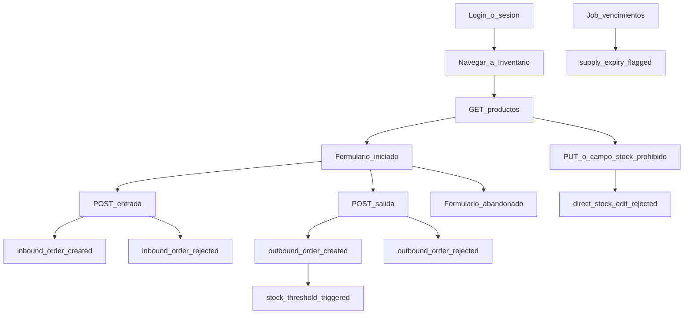

# Plan de Telemetría HealthCore

**Compañía:** HealthCore  
**Hito:** Plan de Telemetría (solo diseño — sin código de captura)  
**Fuente de verdad:** [CONTEXT-healthcore.es.md](./CONTEXT-healthcore.es.md)  
**Catálogo de esquemas:** [event-schemas.json](./event-schemas.json)  
**Versión en inglés:** [telemetry-plan.md](./telemetry-plan.md)

Los identificadores `event_type` son **idénticos** en ambos idiomas.

---

## Resumen ejecutivo

| Métrica | Valor |
| --- | --- |
| **Eventos diseñados** | 47 |
| **Obligatorios (CONTEXT)** | 5 |
| **Oportunidades identificadas** | 42 |
| **Categorías** | Negocio/inventario, autenticación, navegación/UX, rendimiento, errores, incidencias, proveedores, talento, website, plataforma/jobs |

**Decisión de diseño más difícil:** Tratar `direct_stock_edit_rejected` como evento **stream** de control emitido en **rechazo explícito** de la API (incluido `current_stock` prohibido en el body), sin confundirlo con fallos legítimos de validación outbound (`outbound_order_rejected`). El ignore silencioso actual queda documentado como hueco de Capture.

---

## Fase 1 — Catálogo exhaustivo

### Regla de oro

> Capturamos `[event_type]` porque necesitamos saber `[hipótesis]`, lo que nos permite tomar la decisión `[decisión concreta]`.

### Clasificación de origen

| Etiqueta | Significado |
| --- | --- |
| **Obligatorio** | CONTEXT §3 — piso del plan |
| **Identificado** | Propuesto al explorar la aplicación |

### Flujo de inventario (10 puntos de instrumentación)

| # | Paso | `event_type` | Origen |
| --- | --- | --- | --- |
| 1 | Token inválido en ruta de inventario | `session_unauthorized` | Identificado |
| 2 | Abre formulario inbound/outbound | `inventory_form_started` | Identificado |
| 3 | Entrada rechazada | `inbound_order_rejected` | Identificado |
| 4 | Entrada OK | `inbound_order_created` | **Obligatorio** |
| 5 | Salida rechazada (ej. stock insuficiente) | `outbound_order_rejected` | Identificado |
| 6 | Salida OK | `outbound_order_created` | **Obligatorio** |
| 7 | Stock bajo mínimo tras salida | `stock_threshold_triggered` | **Obligatorio** |
| 8 | Intento de editar stock a mano | `direct_stock_edit_rejected` | **Obligatorio** |
| 9 | Formulario abandonado | `inventory_form_abandoned` | Identificado |
| 10 | Barrido de caducidad | `supply_expiry_flagged` | **Obligatorio** |

### Catálogo maestro

Los **5 obligatorios** con regla de oro (CONTEXT):

| `event_type` | Regla de oro (resumen) | Entrega |
| --- | --- | --- |
| `inbound_order_created` | Compras por clínica/proveedor → consolidar y negociar | Batch |
| `outbound_order_created` | Consumo por clínica/departamento → reposición automática | Batch |
| `stock_threshold_triggered` | Frecuencia de quiebre de stock → reabastecimiento urgente | Stream |
| `direct_stock_edit_rejected` | Intentos de saltarse trazabilidad → formación/permisos | Stream |
| `supply_expiry_flagged` | Insumos por vencer → uso o baja controlada | Batch |

**42 eventos identificados** adicionales (auth, navegación, rendimiento, errores, incidencias, proveedores, talento, website, plataforma) con regla de oro, allowlist y entrega documentados en [event-schemas.json](./event-schemas.json) (`x-catalogue`, `x-gold-rule`).

Categorías cubiertas (≥3 exigidas por el curso): **negocio/inventario**, **autenticación**, **navegación**, **rendimiento** (`api_latency_recorded`), **errores** (`frontend_error_captured`, `http_request_failed`).

### Allowlists y datos sensibles

- Todo evento: envelope estándar + `properties` con **allowlist** (`additionalProperties: false` en JSON).
- Inventario obligatorio: `clinic_id`, `country`, `product_id`, `product_category`, `quantity`, `department` solo en outbound.
- Sin PHI: nunca nombre de paciente, MRN, diagnóstico, `reason` del intake.
- `login_failed`: solo `email_hash`, nunca email en claro.
- `intake_form_submitted`: solo códigos (`country`, `clinic_id`, `consent_given`).

Detalle por evento obligatorio: ver [telemetry-plan.md](./telemetry-plan.md) §1.6 (misma estructura en inglés).

---

## Fase 2 — Event Envelope

| Campo | Obligatorio | Descripción |
| --- | --- | --- |
| `eventId` | sí | UUID |
| `timestamp` | sí | ISO 8601 UTC |
| `sessionId` | sí | Sesión UI; null en jobs |
| `userId` | sí | Staff o `system` / `job:*` |
| `event_type` | sí | `entidad_acción` |
| `schemaVersion` | sí | Semver (inicio `1.0.0`) |
| `requestId` | sí | Correlación UI → API → logs |
| `properties` | sí | Payload allowlist |

Esquemas exportados en [event-schemas.json](./event-schemas.json) (JSON Schema draft 2020-12, compatible con validadores draft-07).

---

## Fase 3 — Estrategia de entrega

### Stream vs batch (justificación de negocio)

| Stream | Por qué |
| --- | --- |
| `stock_threshold_triggered`, `direct_stock_edit_rejected`, auth/5xx/UI errors | Marcus/Claire/James necesitan enterarse en minutos, no el lunes |

| Batch | Por qué |
| --- | --- |
| Compras, consumos, caducidad, navegación, latencia agregada | Decisiones diarias/semanales |

### Throttle / debounce

| Evento | Estrategia |
| --- | --- |
| `page_viewed` | Debounce 2 s por `(sessionId, path)` |
| `api_latency_recorded` | Muestreo 10 % + p95 por ruta / 60 s |
| `login_failed` | Máx. 5 / 5 min por `(email_hash, ip_bucket)` |
| `inventory_form_started` | Una vez por `(sessionId, form_name)` hasta submit |
| `session_unauthorized` | Máx. 3 / min por sesión |
| `frontend_error_captured` | Dedupe 30 s mismo `(path, error_name)` |

### Riesgos y exclusiones (descartados)

| Descartado | Motivo |
| --- | --- |
| Datos de paciente en cualquier evento | HIPAA / CONTEXT |
| `api_request_body_logged` | Fuga PHI + costo |
| `keystroke_logged` / `mouse_movement_tracked` | Sin hipótesis; invasivo |
| `incident_description_captured` | PHI en texto libre |
| `product_list_scroll_depth` | Métrica vanidad |

Huecos Capture: `expiry_date`, `min_stock`, `department` en consumo; rechazo explícito de `current_stock` en POST.

---

## Apéndice — Checklist del curso

- [x] Métricas CONTEXT con nombres exactos  
- [x] Catálogo amplio técnico + negocio  
- [x] Regla de oro en cada evento (`x-gold-rule`)  
- [x] Envelope consistente  
- [x] Allowlists documentadas  
- [x] JSON válido y alineado  
- [x] Stream/batch justificado  
- [x] PII identificado y sanitizado  
- [x] Exclusiones con razón  

Solo documentación; sin código de captura en este hito.
