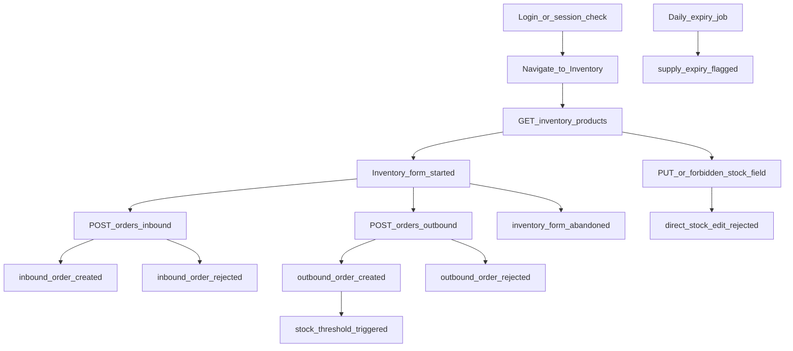

# HealthCore Telemetry Plan

**Company:** HealthCore  
**Milestone:** Telemetry Plan (design only — no capture code)  
**Source of truth:** [CONTEXT-healthcore.md](./CONTEXT-healthcore.md)  
**Schema catalog:** [event-schemas.json](./event-schemas.json)  
**Spanish twin:** [telemetry-plan.es.md](./telemetry-plan.es.md)

---

## Executive summary

| Metric | Value |
| --- | --- |
| **Total events designed** | 47 |
| **Mandatory (CONTEXT)** | 5 |
| **Identified opportunities** | 42 |
| **Categories covered** | Business/inventory, authentication, navigation/UX, performance, errors, incidents, suppliers, talent, website, platform/jobs |

**Hardest design decision:** Treating `direct_stock_edit_rejected` as a **stream** control event emitted on **explicit API rejection** (including forbidden `current_stock` in create bodies), not conflating it with legitimate outbound validation failures (`outbound_order_rejected`). Silent field ignoring today is documented as a capture gap that must become visible rejection + telemetry.

---

## Phase 1 — Exhaustive data opportunity catalogue

### 1.1 Gold rule (applies to every event)

> We capture `[event_type]` because we need to know `[hypothesis]`, which lets us take `[concrete decision]`.

If the sentence cannot be completed, the event is **discarded** (see §Phase 3.3).

### 1.2 Source classification

| Label | Meaning |
| --- | --- |
| **Mandatory** | Required by [CONTEXT-healthcore.md](./CONTEXT-healthcore.md) §3 — must appear in the plan and be instrumented end-to-end in the project series |
| **Identified** | Proposed by this plan from application exploration — extends beyond the CONTEXT floor |

### 1.3 Inventory flow map and instrumentation points

Authenticated operator journey from login through order completion (`uis/backoffice` + `services/app/routers/inventory.py`):

| # | Flow step | `event_type` | Source |
| --- | --- | --- | --- |
| 1 | Missing/expired token hits protected inventory route | `session_unauthorized` | Identified |
| 2 | Operator opens inbound/outbound/product form | `inventory_form_started` | Identified |
| 3 | Inbound validation fails (400/422) | `inbound_order_rejected` | Identified |
| 4 | Inbound succeeds | `inbound_order_created` | **Mandatory** |
| 5 | Outbound validation fails (e.g. insufficient stock) | `outbound_order_rejected` | Identified |
| 6 | Outbound succeeds | `outbound_order_created` | **Mandatory** |
| 7 | Post-outbound stock below minimum | `stock_threshold_triggered` | **Mandatory** |
| 8 | Direct stock mutation attempt rejected (405/403/forbidden body) | `direct_stock_edit_rejected` | **Mandatory** |
| 9 | Form opened but not submitted within session window | `inventory_form_abandoned` | Identified |
| 10 | Scheduled expiry scan | `supply_expiry_flagged` | **Mandatory** |

Additional inventory opportunities: `product_created`, `page_viewed` on inventory routes.

### 1.4 Backoffice and platform surfaces explored

| Zone | Routes / APIs | Telemetry value |
| --- | --- | --- |
| Auth | `/login`, `/register`, `/auth/*`, `/users` | Failed logins, session expiry, reset funnel |
| Inventory | `/inventory/*` | CONTEXT floor + validation + abandonment |
| Incidents | `/incidents`, `/api/incidents/*` | Volume, validation, CSV tooling |
| Suppliers | `/suppliers` | Procurement directory changes |
| Talent | `/applications`, `/candidates/[id]` | Hiring pipeline (workforce PII rules) |
| Website | `/`, `/application` | Intake funnel (no PHI in properties) |
| Platform | Middleware, jobs, Resend | Latency, 5xx, email failures |

### 1.5 Master catalogue

All events include the standard envelope (§Phase 2). Properties allowlists are in §1.6 and [event-schemas.json](./event-schemas.json) (`additionalProperties: false`).

#### Mandatory (CONTEXT)

| `event_type` | Category | Gold rule | Delivery |
| --- | --- | --- | --- |
| `inbound_order_created` | business_inventory | We capture `inbound_order_created` because we need to know how much and what supply is purchased by clinic and vendor, which lets us consolidate purchasing and negotiate better vendor terms | Batch |
| `outbound_order_created` | business_inventory | We capture `outbound_order_created` because we need to know which supplies are consumed most and at what rate by clinic and department, which lets us adjust automatic replenishment per clinic | Batch |
| `stock_threshold_triggered` | business_inventory | We capture `stock_threshold_triggered` because we need to know how often a clinic runs short of critical supply, which lets us prioritise urgent restocking and escalate to Marcus | Stream |
| `direct_stock_edit_rejected` | business_inventory | We capture `direct_stock_edit_rejected` because we need to know if staff attempt to bypass traceability controls, which lets us reinforce training or permissions at the clinic where it happens most | Stream |
| `supply_expiry_flagged` | business_inventory | We capture `supply_expiry_flagged` because we need to know which supplies are about to expire, which lets us prioritise use or controlled disposal before waste or compliance risk | Batch |

#### Identified — business / inventory

| `event_type` | Gold rule | Delivery |
| --- | --- | --- |
| `product_created` | Catalogue growth and category mix → plan stock coverage | Batch |
| `inbound_order_rejected` | Bad inbound payloads by clinic → fix forms and vendor data quality | Batch |
| `outbound_order_rejected` | Stock/validation failures by product → training and UX fixes | Batch |
| `inventory_form_started` | Which inventory flows are opened → prioritise UX work | Batch |
| `inventory_form_abandoned` | Mid-flow drop-off → simplify forms | Batch |

#### Identified — authentication

| `event_type` | Gold rule | Delivery |
| --- | --- | --- |
| `login_succeeded` | Successful access volume → capacity and shift planning | Batch |
| `login_failed` | Failed attempts per day → detect brute force or bad UX | Stream |
| `logout_completed` | Session endings → session hygiene metrics | Batch |
| `user_registered` | Backoffice account growth → access governance | Batch |
| `password_reset_requested` | Reset demand without leaking emails → support load | Batch |
| `password_reset_completed` | Reset completion rate → reduce token/email friction | Batch |
| `password_reset_failed` | Invalid/expired tokens → tune TTL and messaging | Stream |
| `password_changed` | Authenticated password changes → security audit trail | Batch |
| `session_unauthorized` | Expired/missing tokens on API → improve session UX | Stream |
| `session_expired` | Client-detected expiry before API call → proactive re-login prompts | Stream |

#### Identified — navigation / UX

| `event_type` | Gold rule | Delivery |
| --- | --- | --- |
| `page_viewed` | Sections operators visit most (incl. placeholders) → roadmap priority | Batch |
| `form_abandoned` | Generic form drop-off → reduce friction | Batch |

#### Identified — performance

| `event_type` | Gold rule | Delivery |
| --- | --- | --- |
| `api_latency_recorded` | Slow routes by clinic timezone → scale or fix before clinics call | Batch |

#### Identified — errors

| `event_type` | Gold rule | Delivery |
| --- | --- | --- |
| `frontend_error_captured` | Uncaught UI errors by route → fix before operators lose work | Stream |
| `http_request_failed` | 4xx/5xx rates by route → reliability before phone reports | Stream (5xx) / Batch (4xx rollups) |
| `api_unhandled_error` | Unexpected 500s → page on-call | Stream |
| `email_send_failed` | Reset email failures without addresses in payload → fix delivery | Stream |

#### Identified — incidents, suppliers, talent, website, jobs

See [event-schemas.json](./event-schemas.json) `x-catalogue` for the full list of remaining identified events (`incident_*`, `supplier_*`, `talent_*`, `website_*`, `intake_*`, `job_run_completed`).

### 1.6 Property allowlists and sensitivity (mandatory events)

Inventory floor from CONTEXT: `clinic_id`, `country`, `product_id`, `product_category`, `quantity`, `department` (when applicable).

#### `inbound_order_created` — Mandatory

| Property | Type | Required | Sensitive | Sanitization |
| --- | --- | --- | --- | --- |
| `clinic_id` | integer 1–12 | yes | no | — |
| `country` | `US` \| `UK` | yes | no | — |
| `product_id` | integer | yes | no | — |
| `product_category` | enum | yes | no | Map from code category |
| `quantity` | integer ≥ 0 | yes | no | — |
| `vendor_name` | string | yes | no | Vendor org name only |
| `sku` | string | optional | no | — |
| `unit` | string | optional | no | — |
| `order_id` | integer | optional | no | — |

**Allowlist:** `clinic_id`, `country`, `product_id`, `product_category`, `quantity`, `vendor_name`, `sku`, `unit`, `order_id`. No `department`.

#### `outbound_order_created` — Mandatory

| Property | Type | Required | Sensitive | Sanitization |
| --- | --- | --- | --- | --- |
| `clinic_id` | integer | yes | no | — |
| `country` | enum | yes | no | — |
| `product_id` | integer | yes | no | — |
| `product_category` | enum | yes | no | — |
| `quantity` | integer | yes | no | — |
| `department` | string | yes | no | Clinical service code only; never patient id |
| `consumption_type` | enum | optional | no | — |
| `sku`, `unit`, `order_id` | — | optional | no | — |

**Allowlist:** `clinic_id`, `country`, `product_id`, `product_category`, `quantity`, `department`, `consumption_type`, `sku`, `unit`, `order_id`.

#### `stock_threshold_triggered` — Mandatory

**Allowlist:** `clinic_id`, `country`, `product_id`, `product_category`, `quantity` (remaining stock), `current_stock`, `min_stock_threshold`, `threshold_band`. No `department`.

#### `direct_stock_edit_rejected` — Mandatory

**Allowlist:** `clinic_id`, `country`, `product_id`, `product_category`, `quantity` (attempted value if present), `attempted_path`, `http_status`, `rejection_reason`. No `department`.

Emit on: `PUT`/`PATCH` stock routes, rejected body containing `current_stock`/`stock`, inventory middleware rejects.

#### `supply_expiry_flagged` — Mandatory

**Allowlist:** `clinic_id`, `country`, `product_id`, `product_category`, `quantity`, `expiry_date`, `days_to_expiry`, `batch_id`. No `department`. `userId` = `system` or `job:supply_expiry_scan`.

#### Additional events — allowlist pattern

Every event in [event-schemas.json](./event-schemas.json) sets `additionalProperties: false` on `properties` and documents `x-allowlist`, `x-sensitive`, `x-sanitize` where applicable. Examples:

| `event_type` | Allowlist (properties keys only) | Sensitive | Sanitization |
| --- | --- | --- | --- |
| `login_failed` | `http_status`, `email_hash` | staff PII | Never raw email; optional SHA-256 hash |
| `session_expired` | `path`, `app`, `idle_ms` | no | — |
| `api_latency_recorded` | `path`, `method`, `duration_ms`, `http_status` | no | Aggregated in batch sink |
| `frontend_error_captured` | `path`, `error_name`, `component` | no | Never `message` stack with user input |
| `page_viewed` | `path`, `app`, `referrer_path` | no | Debounced (§Phase 3.2) |
| `intake_form_submitted` | `country`, `clinic_id`, `consent_given` | PHI risk | No name/email/phone/reason |

---

## Phase 2 — Event Envelope design

### 2.1 Standard envelope (all events)

| Field | Type | Required | Description |
| --- | --- | --- | --- |
| `eventId` | UUID string | yes | Unique id for idempotency |
| `timestamp` | ISO 8601 UTC | yes | Event time |
| `sessionId` | string \| null | yes | UI session; null for jobs |
| `userId` | string | yes | Staff TinyDB id, or `system` / `job:*` |
| `event_type` | string | yes | Taxonomy `entity_action` (snake_case) |
| `schemaVersion` | semver string | yes | Payload version; start `1.0.0` |
| `requestId` | string \| null | yes | Correlate UI → API → logs (`X-Request-Id`) |
| `properties` | object | yes | Payload; **allowlist only** |

### 2.2 Taxonomy rules

- Pattern: `{entity}_{action}` — e.g. `inbound_order_created`, `stock_threshold_triggered`, `session_expired`, `api_latency_recorded`.
- Verbs: `created`, `rejected`, `triggered`, `flagged`, `recorded`, `captured`, `viewed`, `expired`, `failed`, `completed`, `changed`.

### 2.3 JSON Schema export

[event-schemas.json](./event-schemas.json) uses **JSON Schema draft 2020-12** (compatible with draft-07 validators). Each event definition includes:

- `allOf` envelope + `event_type` const
- **Per-event `properties` object** — each event declares its own allowlist inline; payloads are **not** composed from shared property bags (e.g. no shared `inventory_core`). Field type shapes may be documented in `$defs/inventory_field_types` for reference only; validation enforces the event-specific key list with `additionalProperties: false`.
- `x-source`: `mandatory` | `identified`
- `x-category`, `x-pipeline`, `x-allowlist`, `x-gold-rule`
- `x-sensitive` / `x-sanitize` when applicable

### 2.4 Entity mapping (plan ↔ code)

| CONTEXT | Code |
| --- | --- |
| `Product` | `MedicalSupply` |
| `InboundOrder` | `SupplyDelivery` |
| `OutboundOrder` | `SupplyConsumption` |
| `userId` | staff `user_uuid`; never patient |

`product_category` in events: `medication` | `ppe` | `consumable` | `equipment` — map from code enums at emit time.

---

## Phase 3 — Delivery strategy

### 3.1 Stream vs batch per event (business justification)

| Delivery | Events | Why (business/ops urgency) |
| --- | --- | --- |
| **Stream** | `stock_threshold_triggered`, `direct_stock_edit_rejected`, `login_failed`, `password_reset_failed`, `session_unauthorized`, `session_expired`, `frontend_error_captured`, `api_unhandled_error`, `email_send_failed`, `http_request_failed` (5xx leg) | Marcus/Claire/James need minutes-level awareness: stock crisis, control bypass, auth attack, UI broken, API down |
| **Batch** | All other events incl. `inbound_order_created`, `outbound_order_created`, `supply_expiry_flagged`, `api_latency_recorded`, `page_viewed`, incident/supplier aggregates | Decisions are daily/weekly: purchasing, replenishment patterns, expiry planning, roadmap from nav, performance trends |

**Not chosen for technical preference:** e.g. `inbound_order_created` is batch because vendor consolidation is a weekly finance decision, not a pager event.

### 3.2 Throttle and debounce (high-frequency events)

| Event | Strategy | Rationale |
| --- | --- | --- |
| `page_viewed` | Debounce **2 s** per `(sessionId, path)` | Avoid one page load generating dozens of events on re-renders |
| `api_latency_recorded` | **Sample 10%** + aggregate **p95 per route per 60 s** in batch sink | Full capture would dominate volume; ops needs trend not every ms |
| `login_failed` | **Throttle 5 events / 5 min** per `(email_hash, ip_bucket)` | Detect attacks without log flooding |
| `inventory_form_started` | **Once per (sessionId, form_name)** until submit/abandon | Form remounts should not inflate counts |
| `session_unauthorized` | **Throttle 3 / min** per `sessionId` | 401 retry storms from one expired token |
| `frontend_error_captured` | **Dedupe** same `(path, error_name)` **30 s** | Repeated React strict-mode double fires |

Stream events still pass through throttle where noted; suppressed duplicates may emit a single `x-throttled-count` in batch rollup (implementation detail for Capture).

### 3.3 Risks, exclusions, and discarded opportunities

#### Privacy and compliance exclusions (never capture)

- Patient name, MRN, diagnosis, intake `reason`, incident free-text narrative
- Raw passwords, reset tokens, JWT bodies
- Raw staff/patient email in telemetry (hash or opaque `userId` only)

#### Cost / noise exclusions (considered and discarded)

| Discarded idea | Reason |
| --- | --- |
| `product_list_scroll_depth` | No decision owner; vanity metric |
| `keystroke_logged` | PII/cost; no proportionate decision |
| `api_request_body_logged` | PHI leakage risk; redundant with validation events |
| `mouse_movement_tracked` | No operational hypothesis |
| `incident_description_captured` | PHI; use category/origin codes only |
| `patient_identifier_linked_to_consumption` | Violates CONTEXT; use `department` only |
| `every_health_check_ping` | Noise; use `job_run_completed` + 5xx stream |
| Duplicate `stock_level_viewed` | Redundant with `page_viewed` + product list API metrics |

#### Instrumentation gaps (Capture must close)

- `expiry_date`, `min_stock`, `department` on consumption model
- Explicit reject + event when `current_stock` sent on create (today silently ignored)
- `PUT /inventory/products/{id}` should return 403 + `direct_stock_edit_rejected` (today 405 only)

---

## Phase 4 — Implementation notes for instrumenters

1. Generate `requestId` in backoffice client; forward as `X-Request-Id`.
2. Map `product_category` at emit boundary in `inventory_service.py`.
3. After successful outbound, evaluate threshold and emit `stock_threshold_triggered` if needed.
4. Middleware: inventory mutations outside `/orders/*` → reject + `direct_stock_edit_rejected`.
5. Daily job: `supply_expiry_flagged` with `userId: system`.

---

## Appendix A — Regulatory rules (HIPAA / UK GDPR)

Events describe supplies and staff actions, never patients. `department` = clinical service area, not HR unit of the operator.

---

## Appendix B — Open TODOs

- TODO: Formal clinic master (12 clinics → region aggregation).
- TODO: Confirm expiry job schedule (assumption: daily 06:00 UTC, 30-day window).
- TODO: CONTEXT §5 seed volumes — later capture milestone.

---

## Appendix C — Delivery checklist (course)

- [x] All CONTEXT mandatory metrics present with exact `event_type` names
- [x] Broad catalogue: auth, performance, errors, navigation, business
- [x] Gold rule for every event (see JSON `x-gold-rule` + §1.5)
- [x] Consistent envelope on all events
- [x] Allowlists documented; JSON `additionalProperties: false`
- [x] Stream/batch justified by decision urgency
- [x] Sensitivity and sanitization documented
- [x] Risks and exclusions with reasons
- [x] `event-schemas.json` valid and aligned with this plan

Documentation-only; no capture code in this milestone.
